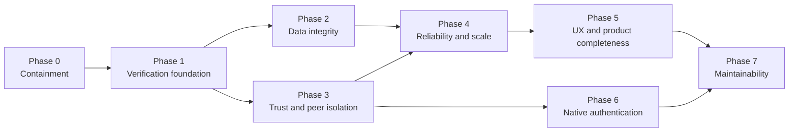

# RedMan Expanded Mitigation Plan

**Created:** 17-07-2026

**Inputs:** [REVIEW.md](REVIEW.md) and [ai-review-2.md](ai-review-2.md)

**Baseline:** commit `118ab79` plus the working-tree changes reviewed on 17-07-2026

**Relationship to the original:** This is a separate, expanded implementation companion to [MITIGATION_PLAN.md](MITIGATION_PLAN.md). It does not replace or modify that plan.

## Current Status

The implementation work for Phases 0-7 is complete on the mitigation branch. RedMan now has explicit hardened `proxy` and native `local` authentication modes, one migration path, bounded run/process pipelines, and a repeatable local quality gate.

Unattended production classification still requires deployment-only gates that cannot be proven in this workspace: validate a designated canary before additional targets, observe actual proxy source addresses, verify the restricted backup account and socket proxy on each configured host, and complete a real Hyper Backup SSH transfer. Do not deploy with guessed `PEER_HOST`, origin, or proxy trust values.

## Delivery Principles

1. **Contain before refactoring.** Disable or fence dangerous behavior before changing its internals.
2. **Write the failing regression first.** Every Critical or High fix starts with a test that reproduces the audited defect.
3. **One invariant per change.** Restore selection, source deletion, peer identity, and run locking should be independently reviewable and reversible.
4. **No silent fallbacks.** Authentication mode, destructive sync policy, restore version, and peer ownership must be explicit.
5. **Do not broaden privileges to make a feature work.** In particular, do not add `CAP_SYS_ADMIN`, unrestricted root SSH, or direct Docker-socket access without a separate threat decision.
6. **Canary one target at a time.** Deploy to a designated canary, run the phase gate, then proceed to other configured targets.
7. **Keep contracts and documentation synchronized.** Schema, API, environment, and behavior changes update `README.md`, `contracts/v1.json`, migrations, seed data, and tests in the same change.
8. **Prove greenfield behavior.** Public product paths must work without private SSH aliases, host paths, accounts, groups, databases, or existing containers; reusable operator profiles stay in gitignored local configuration.

## Phase Map

| Phase | Objective | Indicative effort | Exit meaning |
|---|---|---:|---|
| 0 | Stop known high-impact paths from being exploitable | 0.5-1 day | Controlled use only |
| 1 | Make tests prove protected behavior rather than route existence | 1-2 days | Fixes can be trusted |
| 2 | Restore backup and import data-integrity guarantees | 4-7 days | Restore-safe local operation |
| 3 | Establish real proxy, pairing, SSH, path, and peer boundaries | 5-8 days | Safe multi-peer operation |
| 4 | Make long-running operation bounded and recoverable | 3-5 days | Unattended-operation candidate |
| 5 | Remove misleading controls and repair core workflows | 4-7 days | Product workflows are complete |
| 6 | Add optional native authentication and authorization | 5-10 days | Direct access can be authenticated safely |
| 7 | Consolidate architecture and remove dead paths | 2-5 days | Sustainable maintenance baseline |

Effort is deliberately approximate. A phase closes on its gate, not on elapsed time.

## Implementation Progress

**Branch:** `fix/audit-mitigation-phase-0`

**Started:** 17-07-2026

Completed on this branch:

- [x] Correct historical revision ordering for browse, preview, download, and restore selection.
- [x] Parse snapshot directory timestamps as UTC in retention and delta-keyframe logic.
- [x] Add an idempotent baseline schema migration; clean volumes now start twice without seeding.
- [x] Repair local auth test flags and make live compatibility fail on `401` instead of counting it as success.
- [x] Restore peer quota data to authenticated request context.
- [x] Keep cancelled SSD/Hyper runs terminal instead of overwriting them with `failed`.
- [x] Treat `partial` as terminal in frontend progress polling.
- [x] Bind paired Hyper jobs/runs to stable static peer identities; isolate shutdown and status access by peer.
- [x] Add transactional run claims across manual and scheduled SSD, Hyper, and Rclone triggers.
- [x] Disable unsafe delete-after-import in service, API, UI, and existing database settings.
- [x] Add fail-closed empty/inaccessible-source checks for SSD, Hyper, Rclone upload/download, and bisync.
- [x] Require explicit non-root backup scope and finite quota when accepting a peer.
- [x] Reject malformed, non-Ed25519, and multi-line SSH public keys before authorized-key writes.
- [x] Fix pairing expiry/error transitions and match peers by static identity rather than display name.
- [x] Enforce realpath peer confinement, reject symlink escapes, and create destination directories safely.
- [x] Remove unrestricted root browsing and sensitive RedMan/system paths from the main filesystem picker.
- [x] Stream Hyper rsync file events into bounded database batches and cap retained diagnostic output.
- [x] Use SQLite online backup, integrity checks, staged startup restore, and rollback-safe installation for WAL databases.
- [x] Persist per-file Immich fingerprints/outcomes and delete only verified, unchanged source files.
- [x] Bind protocol-v3 pairing signatures to canonical request/callback transcripts and require fingerprint confirmation.
- [x] Hash incoming peer credentials, encrypt outgoing credentials, and migrate legacy values idempotently.
- [x] Generate forced-command, source-restricted Ed25519 authorization entries for the dedicated `redman-backup` account.
- [x] Route Docker access through a pinned, private socket proxy; remove RedMan's raw socket and host networking.
- [x] Remove Immich credentials from process arguments and enforce a typed settings allowlist.
- [x] Add deterministic fatal/graceful shutdown, bounded child termination, and service-owned scan completion.
- [x] Validate cron expressions and next occurrences exactly, preserve selected minutes, and support eight-hour schedules.
- [x] Make drive ejection an optional narrow-helper capability and disable unsupported UI controls.
- [x] Persist per-snapshot accounting summaries and move deep delta verification into cancellable tracked runs.
- [x] Replace blocking repeated quota scans with fail-closed, asynchronous, invalidated short-lived caching.
- [x] Add lightweight adaptive progress polling that pauses in hidden tabs and stops at terminal state.
- [x] Bound run/file, peer-audit, metric, and stale-summary retention; throttle routine peer-auth writes.
- [x] Give partial and cancellation notifications distinct policy, severity, and terminal ordering.
- [x] Surface initialization and form errors inline, preserving backend safety messages and retry paths.
- [x] Replace every browser alert/confirm and legacy modal surface with one portal-based accessible dialog primitive.
- [x] Eliminate mobile page/dialog overflow across 390x844, 768x1024, 1024x768, and 1440x900 viewports.
- [x] Expose retention for plain/delta versioning and refresh SSD history immediately on filter changes.
- [x] Complete manual Hyper setup with private URL/key, push/pull direction, and validated SSH overrides.
- [x] Project last success/issue, next run, staleness, and verified restore onto configuration cards.
- [x] Persist restore outcomes and optionally verify restored bytes with SHA-256 before reporting recoverability.
- [x] Wire start/progress notification controls across all engines with per-run rate limiting and terminal cleanup.
- [x] Expose normalized exclude patterns, empty-source opt-in, and database retention settings in the UI.
- [x] Consolidate byte formatting, pairing retries, compact snapshot labels, and accessible icon names.
- [x] Accept ADR 001 with explicit, non-fallback `proxy` and `local` authentication modes.
- [x] Add migration 22 identity, Argon2id credential, opaque session, recovery, and auth-audit schema.
- [x] Implement first-admin bootstrap, login/logout, session expiry, CSRF, password rotation, and one-time host recovery.
- [x] Add provider-specific admin/viewer roles and fail-closed permission declarations for every contracted API route.
- [x] Preserve Pangolin proxy mode while requiring exact HTTPS origin, narrow trusted proxy CIDRs, and explicit account provisioning.
- [x] Add account/session/audit UI, viewer self-account access, and read-only feature controls.
- [x] Revoke sessions on logout, recovery, role/disable changes, password rotation, and database restore.
- [x] Harden concurrent lockout/recovery, opaque proxy subjects, client-IP derivation, and private database backup modes.
- [x] Preserve per-target auth configuration during deploy and remove shipped admin auto-provisioning.
- [x] Consolidate schema ownership in numbered migrations 0-25 and make seeding data-only.
- [x] Share feature-scoped run claims, pagination, progress, detail, ownership, and cancellation transitions.
- [x] Use one bounded, chunk-aware rsync parser and process registry for local and SSH transfers.
- [x] Remove abandoned delta, notification, redaction, shell-deletion, and frontend plumbing while preserving frozen v1 exports.
- [x] Normalize and validate `PEER_API_PORT`, `PEER_HOST`, and SSH runtime configuration across every launch artifact.
- [x] Extract and component-test the repeated per-job notification policy UI.
- [x] Add a noninteractive lint, regression, clean-start, compatibility, build, audit, browser, and accessibility gate.

Validated on this branch:

- 71 focused and integration regression files passed.
- Pairing protocol-v3 flow and 16 transcript-tamper checks passed.
- Static compatibility: 685 passed, 0 failed, 2 skipped.
- Strict live API/peer compatibility: 711 passed, 0 failed, 0 skipped.
- Strict live compatibility: 466 passed, 0 failed, 19 skipped.
- Comprehensive SSD/delta/restore suite: 88 passed, 0 failed; 1,416 file operations and 676 delta chains verified.
- Full production and development dependency audit: 0 vulnerabilities.
- ESLint, frontend production build, backend syntax checks, and editor diagnostics passed.
- Repeatable `npm --prefix app run validate` gate passed end to end.
- Playwright browser/Axe smoke: 5 passed across desktop/mobile, 1 intentionally skipped desktop-only mobile-navigation case.
- Independent final correctness review: no unresolved Critical, High, or Medium findings.
- Final Alpine image built from the workspace lock and passed health, local-auth, schema-25, and graceful-shutdown smoke checks.
- Greenfield Linux/Unraid SSH acceptance passed: clean account/group provisioning, shared root ownership, replaceable and replayed reboot persistence, canonical-root key filtering, scoped rsync, and injected-key/shell/PTY/forwarding/path-escape rejection.
- Greenfield Compose acceptance passed from empty host paths with managed host-key add/revoke, redacted public health, authenticated health details, first-admin bootstrap/login, generic storage roots, pruned dependency fixtures, and no mandatory Docker proxy sidecars.
- Live exact-path Docker proxy acceptance passed: container/network listing, single-snapshot stats, start, and stop work; archive, logs, exec, create, restart, kill, query expansion, and read-proxy mutation are denied. Greenfield Compose also enables both optional sidecars and exercises RedMan's real Dockerode list/start/synthesized-restart/stop flow.
- Public deploy tooling contains no built-in private targets: generic `--custom` configuration and gitignored `--profile NAME` files are both fail-closed and regression tested.
- Playwright page-overflow matrix: 24 route/viewport combinations passed; stacked dialog focus/inert/Escape behavior passed live.
- Native local-auth browser flow: bootstrap, logout, generic failure, login, accounts/audit, viewer restrictions, and recovery UI passed.
- Final security review: 0 Critical, 0 High; all auth release blockers verified fixed.
- Final Alpine image: Argon2id/SQLite loaded; fail-closed startup, direct-spoof rejection, provisioned proxy, and mutation-origin policy passed.

Deferred because they require deployment facts or a separate architectural phase:

- [ ] Narrow the production forward-auth allowlist after observing the actual reverse-proxy source on each configured host; SSH key-agent access was unavailable during this tranche.
- [ ] Run the committed `redman-backup` bootstrap and socket-proxy deployment on a designated canary, then each additional target; real-host SSH verification remains unavailable.

---

## Phase 0 - Immediate Containment

**Goal:** reduce current exposure without depending on large code changes.

### P0.1 Fence the main API

- Determine the actual socket source address RedMan sees for an authenticated Pangolin/Newt request.
- Set `TRUSTED_PROXIES` to that exact address or the narrowest required container subnet.
- Change an empty `TRUSTED_PROXIES` value to mean **trust none**.
- Firewall port 8090 so ordinary LAN and site-to-site VPN clients cannot reach it directly. Do not bind to loopback until Newt routing has been verified.
- Keep the health check local and unauthenticated; do not expose administrative routes through the health endpoint.

**Done when:** a direct request from LAN/VPN with `Remote-User: admin` returns `401`; the same route through an authenticated Pangolin session succeeds; an unauthenticated public request is redirected by Pangolin.

### P0.2 Disable unsafe delete-after-import

- Force existing `delete_after_import` settings off.
- Hide or disable the toggle until Phase 2 has a per-file import/deletion ledger.
- Preserve source media after partial, ambiguous, interrupted, or parser-failed imports.

**Done when:** no production path recursively deletes recognized media based only on process exit code or aggregate upload count.

### P0.3 Quarantine historical restore operations

- Temporarily disable historical preview, download, and restore for snapshots whose file resolution can traverse multiple later versions.
- Keep backup creation available, but show a clear operational warning in the version browser.
- Take a manual known-good copy of important data before testing the repair.

**Done when:** RedMan cannot silently return bytes from a revision other than the selected snapshot.

### P0.4 Freeze and audit pairing privileges

- Do not accept new peer pairings until Phase 3.
- Audit every configured host's `authorized_keys` file for RedMan-added keys and unexpected duplicate/newline entries.
- Restrict existing keys by source IP where feasible, or temporarily remove host authorization when Hyper Backup is not running.
- Narrow every existing peer's `allowed_path_prefix`; no peer should retain `/`.
- Confirm port 8091 is reachable only over the intended LAN/WireGuard paths, never as a public Pangolin resource.

**Done when:** existing peer keys and prefixes are inventoried, no default `/` prefix remains, and new pairing is operationally frozen.

### P0.5 Establish a recovery point and release freeze

- Back up the live SQLite database, rclone configuration, identity file, SSH material, and deployment configuration out of the RedMan data volume.
- Record current container image IDs and source commit for every deployed instance.
- Pause broad feature work until the Phase 1 harness can detect protected-route failures.

**Done when:** every deployed instance has a tested rollback bundle and no unreviewed release can bypass the phase gates.

### Phase 0 Gate

- Direct header spoofing is blocked operationally.
- Delete-after-import is disabled.
- Historical restore cannot silently serve an unverified revision.
- New pairing is paused and existing peer access is scoped.
- Rollback artifacts exist for every configured target.

---

## Phase 1 - Verification Foundation

**Goal:** ensure subsequent fixes are measured against real authenticated behavior.

### P1.1 Repair local authentication setup

- Add `REDMAN_LOCAL_DEV=1` alongside `AUTH_DISABLED=true` in `test/setup_local_test.sh`.
- Assert that the production guard still ignores both flags when `NODE_ENV=production`.
- Add a test for missing identity headers and a test for untrusted identity-header sources.

**Done when:** protected local test requests succeed through the intended development bypass, while production-mode bypass attempts return `401`.

### P1.2 Stop compatibility tests accepting `401` as success

- Separate “route exists” checks from “protected operation worked” checks.
- Require expected success codes and response schemas for authenticated tests.
- Treat unexpected `401`, `403`, HTML error bodies, or skipped assertions as failures.

**Done when:** deliberately breaking test authentication fails the live suite rather than reporting hundreds of passes.

### P1.3 Test production handshake code directly

- Replace duplicated cryptographic primitives in the standalone handshake test with imports from production modules.
- Add tamper cases for instance name, token, role/direction, static key, ephemeral key, callback URL, and SSH public key.
- Preserve a version-compatibility fixture for every accepted handshake version.

**Done when:** changing any signed transcript field fails validation and the test exercises the same functions used by pairing routes.

### P1.4 Make validation commands reliable

- Mark `pre-push.sh` executable or change all documentation and hooks to invoke it with `bash`.
- Add explicit package scripts for backend syntax, integration tests, frontend build, dependency audit, and accessibility/browser smoke checks.
- Add a clean-volume startup test using a temporary `DB_PATH`.

**Done when:** one documented non-interactive command runs all release gates from a clean checkout.

### P1.5 Add failing regression fixtures before fixes

Create deterministic tests for:

- repeated-mutation snapshot restore;
- mixed-success media import with deletion requested;
- direct forged forward-auth headers;
- empty database startup;
- one-byte peer quota;
- symlink prefix escape;
- two-peer shutdown isolation;
- unrelated run lookup;
- manual/manual and scheduled/manual overlap;
- cancel-to-terminal-state behavior;
- Hyper/Rclone empty-source handling;
- online DB backup and staged restore.

**Done when:** each known defect fails for the expected reason on the reviewed baseline.

### Phase 1 Gate

- No protected-route test treats `401` as a pass.
- Handshake tests import production logic.
- All Critical/High findings have a reproducer or an explicit testability exception.
- The frontend production build and backend syntax checks remain green.

---

## Phase 2 - Data Integrity and Recovery

**Goal:** make RedMan's backup, restore, import, and database recovery claims true.

### P2.1 Correct historical revision resolution

- For a selected snapshot, inspect only version directories newer than that snapshot, in ascending order.
- Stop at the earliest applicable saved copy for each path.
- Apply identical semantics to browse, preview, download, restore, and delta reconstruction.
- Define behavior for deleted, renamed, type-changed, and multiply-modified paths.

**Done when:** a four-generation fixture restores every generation byte-for-byte, including a file changed in three consecutive runs.

### P2.2 Normalize snapshot time semantics

- Keep generated timestamps explicitly UTC or explicitly local, never mixed.
- If timestamp directory names represent UTC, append `Z` when converting them to `Date`.
- Test retention boundaries across CET/CEST transitions and around midnight.

**Done when:** displayed snapshot time, retention age, and keyframe age agree in `Europe/Amsterdam`, UTC, and a DST transition fixture.

### P2.3 Replace recursive media deletion with a durable ledger

- Record one result per source file: uploaded, server-confirmed duplicate, skipped, failed, or unknown.
- Delete only files individually proven uploaded or confirmed duplicate according to an explicit policy.
- Verify asset identity with checksum or stable server asset ID where supported.
- Write a deletion audit before unlinking and retain failed/unknown source files.
- Require a fresh destructive confirmation when enabling the feature.

**Done when:** a mixed 6-success/4-failure fixture deletes exactly the six proven files and preserves the other four after restart.

### P2.4 Create a non-destructive baseline schema migration

- Add idempotent `CREATE TABLE IF NOT EXISTS` and index creation for every baseline object before ALTER/seed-dependent migrations.
- Keep `seed.js` only for explicit development/demo reset data.
- Ensure startup never drops user data.
- Reconcile the baseline against `contracts/v1.json` and seed schema.

**Done when:** an empty volume starts successfully, an existing production DB migrates without data loss, and running startup twice is a no-op.

### P2.5 Make SQLite backup and restore WAL-safe

- Use `better-sqlite3` online `db.backup()` for live backups.
- Run `PRAGMA integrity_check` against the produced backup.
- Stage restore files beside the active DB and write a restart marker.
- On startup, before opening the production DB, atomically swap the staged file and remove stale WAL/SHM companions.
- Preserve the previous DB for rollback until the restored DB passes integrity checks.

**Done when:** concurrent writes during backup are present in a valid backup and a staged restore survives restart with `integrity_check = ok`.

### P2.6 Apply one source-health policy to every destructive engine

- Share mount identity, accessibility, minimum-item, and empty-source checks across SSD, Hyper, Rclone sync, and future destructive jobs.
- Require an explicit per-job opt-in for a genuinely empty source.
- Re-check source health immediately before launching the child process.
- Keep source and destination overlap checks symmetric, including source-inside-another-destination cases.

**Done when:** an unmounted/empty source cannot delete a populated destination in any engine and intentional empty sync requires explicit confirmation.

### P2.7 Move run locking to the executor boundary

- Acquire one normalized, transactional config/job lock for manual, scheduled, retry, and API-triggered execution.
- Normalize lock keys with `Number(configId)`.
- Return `409 Conflict` with the active run ID when a duplicate trigger arrives.
- Ensure pruning/version processing shares the same destination lock.

**Done when:** double-click, concurrent API calls, and scheduler/manual races all produce one child process and one active run.

### P2.8 Make terminal run status monotonic

- Centralize transitions and prevent executors from overwriting `cancelled` with `failed`.
- Define terminal states once: `completed`, `partial`, `failed`, and `cancelled`.
- Scope cancel endpoints by feature and run ownership.
- Reuse Rclone's signal-aware handling for rsync paths.

**Done when:** cancellation remains `cancelled`, wrong-feature cancellation returns `404`, and every run reaches exactly one terminal state.

### P2.9 Strengthen restore verification

- Add optional checksum verification after restore and persist the result.
- Keep a durable “last verified” timestamp and result per configuration.
- Add a small scheduled restore-drill mode that restores into an isolated destination and compares bytes.

**Done when:** the UI and API can prove when a backup was last restored and verified, not merely when it was last written.

### Phase 2 Gate

- Repeated-mutation restore passes byte-for-byte.
- Mixed-result import cannot delete unproven source files.
- Empty-volume startup and WAL-safe backup/restore pass.
- Every destructive engine blocks unhealthy/empty sources.
- Overlapping runs and non-monotonic terminal states are impossible in tests.

---

## Phase 3 - Authentication, Pairing, and Peer Isolation

**Goal:** make every trust boundary explicit and enforce it in both HTTP and SSH transports.

### P3.1 Permanently harden delegated forward auth

- Rename the middleware and documentation from Authelia-specific terminology to generic forward auth/Pangolin Badger.
- Default `TRUSTED_PROXIES` to trust none; require an explicit production value.
- Strip identity headers before evaluating them unless the socket source is trusted.
- Add `AUTH_MODE=proxy` as an explicit mode; never silently fall back to header trust or development bypass.
- Keep direct port 8090 firewalled from ordinary LAN/VPN clients.

**Done when:** external Pangolin access works, direct forged headers fail from every non-proxy source, and an unset production proxy allowlist fails closed.

### P3.2 Replace `/` peer defaults and repair filesystem roots

- Require an explicit peer backup root during acceptance; never create a peer with `allowed_path_prefix='/'`.
- Set a conservative default quota rather than unlimited storage.
- Remove `/` from automatically advertised/allowed browser roots.
- Deny RedMan's data directory, `.ssh`, identity, DB, rclone config, `/proc`, `/sys`, and other sensitive paths regardless of configured roots.

**Done when:** accepting a peer cannot browse or prepare outside its dedicated backup root and the admin filesystem picker cannot expose RedMan secrets.

### P3.3 Enforce real filesystem boundaries

- Resolve configured roots and existing requested ancestors with `realpath`.
- Reject symlinks that leave the authorized root.
- Create missing path segments one at a time and re-check the final real path.
- Apply the same canonical boundary to browse, prepare, restore, and SSH transport.

**Done when:** a symlink inside an allowed root pointing to `/etc` is rejected by every relevant endpoint and transfer path.

### P3.4 Replace unrestricted root SSH authorization

- Use a dedicated unprivileged backup account on each NAS.
- Validate submitted public keys as one well-formed supported key line.
- Write `restrict`, `from=`, and a forced `rrsync`/wrapper command scoped to the peer root.
- Match/deduplicate on key body after options are added.
- Make host-key authorization an explicit, auditable pairing step.
- Remove the writable bind to root's general `authorized_keys` where possible.

**Done when:** rsync inside the permitted root succeeds, arbitrary commands/tunnels/PTY fail, newline injection is rejected, and compromise of the RedMan container cannot append a general root key.

**Greenfield portability:** Complete. `scripts/setup-backup-user.sh` provisions a clean generic Linux/OpenSSH host without pre-existing users/groups; its root-owned reader emits only canonical installer-approved forced-`rrsync` entries, while `setup-unraid-backup-user.sh` adds replaceable and executable reboot persistence. Compose uses explicit host data/storage/media/key paths, runtime storage roots are configurable, and reusable deployment targets live only in gitignored local profile configuration.

### P3.5 Version and sign the complete pairing transcript

- Introduce a new handshake version.
- Canonically encode and sign protocol version, role/direction, token, instance ID/name, ephemeral key, static key, callback URL, SSH key, and requested scope.
- Reject unknown fields or ambiguous canonical encodings.
- Provide a deliberate transition path; never downgrade automatically.

**Done when:** mutating any transcript field invalidates the signature and legacy peers receive an explicit upgrade response.

### P3.6 Require verifiable peer identity and stable matching

- Show the identity fingerprint before acceptance and require explicit out-of-band confirmation.
- Match existing peers by static public key or stable peer ID, never display name.
- Move expiry validation before the `accepting` transition and force every exception into `failed` or `expired`.
- Generate a fresh token/state for “Try Again”.

**Done when:** two default-named RedMan instances remain distinct, expired/failed pairings never stick in `accepting`, and retry cannot reuse consumed state.

### P3.7 Persist and enforce peer ownership

- Add stable `peer_id` ownership to Hyper jobs and runs.
- Scope shutdown updates to `req.peer.id`.
- Scope `/peer/backup/status/:runId` to Hyper runs owned by the requesting peer.
- Return `404` for unrelated local, feature, or peer runs and redact internal paths from peer-facing errors.

**Done when:** peer A cannot read or alter peer B, SSD, Rclone, or Media Import run state.

### P3.8 Restore quota enforcement

- Include `storage_limit_bytes` in the authenticated peer context.
- Check both current usage and projected/reserved incoming size.
- Make concurrent prepare requests reserve capacity transactionally.
- Define behavior when usage calculation times out or is unavailable; fail closed for bounded peers.

**Done when:** a one-byte quota blocks prepare, concurrent reservations cannot exceed quota, and `/peer/storage` reports the configured value.

### P3.9 Constrain server-initiated requests

- Centralize URL parsing and DNS resolution for pairing, sync, connectivity, test-connection, and callbacks.
- Allow only configured private/VPN ranges and explicit hostname allowlists.
- Validate IPv4 and IPv6 strictly, re-check resolved addresses, and defend against DNS rebinding.
- Constrain callback ports to the expected peer API or an explicit allowlist.
- Add abort timeouts and response-size limits.

**Done when:** public/cloud-metadata targets, malformed private IPs, rebinding, and arbitrary private ports are rejected while configured VPN peers work.

**Implemented evidence:** all validated private peer, pairing, callback, connectivity, and discovery requests force `redirect: 'error'`; callers cannot override it. Numeric private-address and callback policy regressions remain in the focused gate.

### P3.10 Reduce secret-store blast radius

- Hash peer API keys at rest and compare hashes; show plaintext only once at creation/rotation.
- Document that identity, SSH, and rclone secrets remain sensitive even at mode 0600.
- Evaluate encrypted storage or host-volume encryption for unattended secrets.
- Remove secrets from process arguments, including the Immich API key; prefer environment/stdin/config file with restrictive permissions.
- Rotate credentials after containment changes.

**Done when:** a copied database does not reveal live peer API keys and process listings do not reveal the Immich key.

### P3.11 Constrain high-privilege control surfaces

- Replace arbitrary settings writes with a typed key allowlist and per-key validation.
- Put Docker access behind a socket proxy exposing only required endpoints.
- Document that Docker start/stop/create is host-root-equivalent even when the socket mount is read-only.
- Separate read-only monitoring from mutation privileges where practical.

**Done when:** unknown settings keys return `400`, RedMan cannot call unapproved Docker endpoints, and discovery still works within its declared permissions.

**Implemented evidence:** RedMan rejects raw Docker sockets and uses separate repository-built exact-path sidecars. The read side permits only container/network listing and single-snapshot stats; the control side permits only start/stop, with restart synthesized from filtered state plus those calls. Pure and live-daemon tests deny broader reads and mutations.

### P3.12 Triage production dependencies

- Re-run `npm audit --omit=dev` against the current lockfile.
- Upgrade direct dependencies where compatible and document reachability/mitigation for unresolved transitive advisories.
- Add a repeatable audit gate with an explicit, reviewed exception file rather than silently accepting advisories.

**Done when:** no unreviewed Critical/High production advisory remains and the frontend/backend build and integration suite pass after upgrades.

### Phase 3 Gate

- Pangolin proxy mode fails closed and direct spoofing is blocked in code and network policy.
- Peers have explicit roots/quotas and cannot escape via symlink.
- SSH grants rsync-only access as a non-root account.
- The full pairing transcript is signed and fingerprint-confirmed.
- Peer A cannot inspect or mutate peer B.
- SSRF/callback probes and dependency gates pass.

---

## Phase 4 - Runtime Reliability and Scale

**Goal:** bound memory, I/O, retries, polling, and shutdown behavior for multi-TB use.

### P4.1 Make shutdown and fatal errors deterministic

- Stop accepting new work, then stop the scheduler.
- Signal children and await `close` with a bounded grace period before final DB transitions.
- Flush queued run-file inserts and notification state.
- Exit non-zero after `uncaughtException`/fatal rejection so Docker restarts a clean process.

**Done when:** SIGTERM during transfer leaves consistent terminal state and partial data, while an injected uncaught exception causes a supervised restart rather than continued execution.

### P4.2 Add peer control-plane timeouts

- Use `AbortController` for every peer `fetch`.
- Set separate connect/response budgets and abort underlying requests during shutdown.
- Classify timeout errors as retryable or terminal consistently.

**Done when:** a peer accepting TCP but never responding cannot hold a run indefinitely.

### P4.3 Stream and batch Hyper rsync output

- Reuse one itemize/progress parser for local and SSH rsync.
- Insert file events in bounded transactions as output arrives.
- Remove whole-run stdout accumulation and second-pass parsing.
- Keep parser grammar identical for spaces, deletions, and platform variants.

**Done when:** a 100,000-file Hyper transfer has bounded heap growth and file rows appear incrementally.

### P4.4 Replace heavy fixed polling

- Treat `partial` as terminal.
- Add lightweight progress-only endpoints without 1,000 file rows or aggregations.
- Use adaptive intervals, suspend polling while the document is hidden, and stop immediately at terminal state.
- Consider SSE using the existing notification transport for active runs.

**Done when:** terminal runs generate no further polling and active-run requests stay small and bounded.

### P4.5 Add database retention and write throttling

- Define retention for `backup_runs`, `backup_run_files`, peer audit rows, metrics, and summaries.
- Rate-limit `last_seen` updates and successful-auth audit inserts per peer.
- Preserve failures/security events longer than routine success telemetry.

**Done when:** sustained operation reaches a stable database size and active transfer polling does not create constant SQLite writes.

### P4.6 Correct scheduler behavior

- Use a proven cron parser for validation, description, and next occurrence.
- Reject invalid expressions before persistence.
- Keep one run row across retries or explicitly relate attempts to a parent run.
- Distinguish skip, retry, partial, cancellation, and failure in run history.

**Done when:** weekly/monthly schedules show the correct next time and one cron tick has one traceable run lineage.

### P4.7 Move media scan completion into the service

- Remove route-owned unbounded intervals.
- Let `runScan` own completion, cancellation, cleanup, and side effects.
- Derive file dates from the configured mount path.
- Correlate each import with its own Immich log rather than “most recent log”.

**Done when:** deleting a drive mid-scan leaks no timer and concurrent imports cannot consume each other's logs.

### P4.8 Decide the drive-ejection contract

- Prefer a narrow host-side helper or documented manual eject over granting broad `CAP_SYS_ADMIN`.
- Hide/disable eject in environments where the capability is unavailable.
- Report a precise unsupported-state message rather than a generic warning.

**Done when:** the UI never offers a control that is guaranteed to fail in the shipped container.

### P4.9 Make version accounting incremental

- Store per-snapshot file count, bytes, delta savings, and tier metadata when a snapshot is created.
- Update aggregates transactionally during prune/rebase.
- Avoid recursive full-tree stats after every backup and list request.

**Done when:** snapshot listing and post-run accounting scale with snapshot count, not total file count across history.

### P4.10 Run deep verification as a tracked job

- Move `verifyDeltaChain` out of a synchronous request.
- Persist progress/result/cancellation and expose it through the standard run model.
- Clean temporary reconstruction files on completion, cancellation, and restart.

**Done when:** a long verification returns quickly with a job ID and reports bounded progress without tying up one HTTP request.

### P4.11 Cache expensive quota usage safely

- Cache `du` results with a short TTL and invalidate after known writes.
- Do not run the same `du` twice in one prepare request.
- Bound execution time and surface “usage unavailable” according to quota policy.

**Done when:** repeated storage requests return from cache and a large tree cannot block the event loop/request worker for 30 seconds each time.

### P4.12 Correct notification semantics

- Give `partial` its own title, severity, and body.
- Wire cancellation events only after terminal state is committed.
- Ensure notification failures never mutate backup outcome.

**Done when:** a partial run is not announced as “failed - Unknown error” and cancellation produces one consistent event.

### Phase 4 Gate

- Shutdown, timeout, retry, and fatal-error fault injection pass.
- Hyper memory remains bounded under a large-file-count fixture.
- Polling and telemetry writes are bounded.
- Long-running verification is asynchronous.
- Snapshot listing/accounting no longer recursively scans all versions.

---

## Phase 5 - UX and Product Completeness

**Goal:** ensure visible controls are functional, consequences are clear, and core status is readable on desktop and mobile.

### P5.1 Surface API and initialization errors

- Catch submit failures in SSD, Hyper, and Rclone forms.
- Render persistent inline summaries and field-level validation.
- Replace empty initialization catches with actionable retry/error states.
- Preserve backend safety messages verbatim where safe.

**Done when:** an overlap/empty-source validation error is visible in the modal and can be corrected without opening developer tools.

### P5.2 Introduce one accessible dialog primitive

- Provide dialog semantics, labels, focus trap/restoration, Escape, background inertness, and accessible icon names.
- Replace repeated modal markup and browser `alert()`/`confirm()` flows.
- Cover delete, restore, pairing, secrets, and destructive toggles.

**Done when:** keyboard-only and screen-reader smoke tests pass for every destructive or credential dialog.

### P5.3 Repair responsive layouts

- Remove fixed/min widths causing Settings and SSD overflow.
- Constrain header title, timestamps, tables, controls, and snapshot labels.
- Test 390 x 844, 768 x 1024, 1024 x 768, and desktop viewports.

**Done when:** no horizontal page scroll or clipped control remains at the audited mobile/tablet sizes.

### P5.4 Validate and preserve schedules

- Validate cron on client and server.
- Fix every-eight-hours mapping and preserve minute fields in descriptions.
- Use the same parser/formatter as Phase 4 scheduler logic.

**Done when:** opening and saving a valid custom schedule is lossless and invalid cron cannot be enabled.

### P5.5 Expose applicable retention and refresh behavior

- Show retention controls for every versioned configuration, not only delta-enabled ones.
- Refresh run history immediately when its configuration filter changes.
- Explain whether deleting a config keeps or removes destination snapshots.

**Done when:** plain-versioning users can inspect/edit active retention and filters apply without a manual refresh.

### P5.6 Complete or remove Hyper setup paths

- Make “Enter URL manually” provide a real manual URL path, or remove it.
- Expose direction, SSH user/host/port only if those modes are supported and safely validated.
- Remove orphaned `showAdvanced`, destination suffix, and form state when not shipping those features.

**Done when:** every visible setup path can produce a valid job and no API-only option is implied by non-functional UI.

### P5.7 Put backup health on configuration cards

- Show last success, last failure, last verified restore, current staleness, and next run.
- Distinguish “backup completed” from “restore verified”.
- Link directly to the relevant run or verification result.

**Done when:** a user can answer “is this data protected and recoverable?” from the configuration list.

### P5.8 Finish or remove notification controls

- Wire start, cancellation, and progress notifications into executors with rate limits, or remove their toggles/settings/exports.
- Keep completion/failure/partial semantics aligned across all engines.
- Remove legacy ntfy keys after a documented migration.

**Done when:** every visible notification control has an executor-level integration test.

### P5.9 Expose pending safety settings coherently

- Add UI and documentation for `exclude_patterns`, empty-source opt-in, and run-file retention if they remain supported.
- Keep dangerous options under an advanced destructive-settings section with consequence text.
- Validate and preview exclude patterns before saving.

**Done when:** backend-supported safety fields can be inspected and changed through the UI and survive round trips unchanged.

### P5.10 Improve restore and destructive-action confidence

- Display exact source, destination, selected timestamp, expected revision, overwrite behavior, and verification option before restore.
- Explain delete-after-import and job-deletion consequences.
- Keep durable success/failure results instead of transient browser alerts.

**Done when:** destructive actions require informed confirmation and leave an auditable result.

### P5.11 Finish small interaction defects

- Generate fresh pairing state for “Try Again”.
- Shorten/reflow snapshot option labels for narrow controls.
- Use one shared `formatBytes` frontend utility.
- Give unfamiliar icon-only actions tooltips and accessible names.

**Done when:** targeted UI regression tests cover retry, snapshot selection, byte formatting, and icon labeling.

### Phase 5 Gate

- No visible control is knowingly inert or impossible to complete.
- Validation errors and destructive consequences are visible.
- Mobile/tablet and accessible-dialog checks pass.
- Configuration cards expose backup and restore-verification health.

---

## Phase 6 - Native Authentication and Authorization

**Goal:** complete the currently unfinished native-login capability without weakening hardened proxy mode.

This phase is optional for proxy-only homelab use after Phase 3, but required before direct access to port 8090 is considered a supported deployment mode.

### P6.1 Write an authentication ADR and threat model

Choose explicitly among:

- `proxy`: Pangolin Badger supplies identity; RedMan trusts only configured proxy sources;
- `local`: RedMan owns credentials, sessions, recovery, and authorization;
- `oidc`: RedMan validates an external identity provider directly;
- a deliberately supported combination with deterministic precedence.

Do not auto-fallback from one mode to another. Document first-run bootstrap, lockout recovery, reverse-proxy interaction, and headless API access.

**Done when:** the ADR defines trust boundaries, supported modes, migration, recovery, and failure behavior before schema/UI work starts.

### P6.2 Add a minimal identity and role model

- Add users, credential methods, sessions, recovery events, and audit tables through numbered migrations.
- Start with `admin` and `viewer`; require explicit permissions for restore, deletion, peer management, Docker mutation, secrets, and settings.
- Map trusted proxy identity to an account only under an explicit provisioning policy.

**Done when:** an authenticated viewer cannot invoke any mutating or secret-bearing endpoint and every existing route has a declared permission.

### P6.3 Implement secure credentials or passkeys

- Prefer passkeys/WebAuthn or OIDC where practical.
- If passwords are supported, hash with a maintained Argon2id implementation using per-user salts and current parameters.
- Add rate limiting, generic failure responses, lockout/backoff, secure recovery, and credential rotation.
- Never ship default credentials.

**Done when:** credential storage, brute-force resistance, recovery, and rotation pass a dedicated security review.

### P6.4 Implement server-side sessions and CSRF protection

- Use random opaque session tokens stored hashed server-side.
- Set `Secure`, `HttpOnly`, and appropriate `SameSite` cookie attributes.
- Rotate on login/privilege change, enforce idle/absolute expiry, and revoke on logout/recovery.
- Protect state-changing cookie-authenticated requests against CSRF.

**Done when:** session fixation, replay after logout, cross-site mutation, and expired-session tests fail closed.

### P6.5 Add first-run login and account management UX

- Present first-admin setup only when no account exists and only through a controlled local/bootstrap path.
- Add login, logout, session-expired, credential enrollment, recovery, and account/audit views.
- Preserve return paths without permitting open redirects.

**Done when:** a clean install can securely establish one admin and all subsequent unauthenticated API/UI requests require login.

### P6.6 Preserve proxy mode as a first-class deployment

- Keep Pangolin Badger compatibility and rename `autheliaAuth` to a provider-neutral boundary.
- Validate and normalize proxy identity fields; do not grant access from header presence alone.
- Make proxy-only deployments avoid a redundant second login while still applying RedMan authorization roles.

**Done when:** both proxy and local modes pass the same authorization suite and neither can be activated accidentally.

### P6.7 Add authentication migration and recovery tests

- Test upgrades from proxy-only databases.
- Test lost credential/recovery paths without DB surgery.
- Test mode changes, disabled accounts, role changes, session revocation, backup/restore of auth tables, and clock skew.

**Done when:** switching modes cannot create an unauthenticated window or lock out all administrators without a documented recovery mechanism.

### Phase 6 Gate

- Authentication mode is explicit and fail-closed.
- Native login, sessions, recovery, and route authorization have security tests.
- Proxy mode remains compatible with Pangolin Badger.
- Direct port 8090 is supported only in an authenticated mode and remains firewalled by default.

---

## Phase 7 - Maintainability and Cleanup

**Goal:** remove the duplication and dead paths that allowed behavior to drift.

### P7.1 Consolidate schema ownership

- After the Phase 2 baseline migration is proven, move remaining inline `db.js` migrations into numbered migrations.
- Keep schema definitions in one authoritative migration path; keep `seed.js` for data only.
- Add a schema snapshot/contract comparison test.

**Status:** Complete. Migrations 23-25 absorb legacy startup repairs, ntfy aliases, and peer SSH identity/access cleanup; `db.js` only orchestrates startup, `seed.js` is data-only, and compatibility inspects an actual migrated database.

### P7.2 Share run lifecycle plumbing

- Extract common run list/detail/cancel/trigger validation without hiding feature-specific executor behavior.
- Centralize status transitions, ownership checks, pagination, and progress-only responses.

**Status:** Complete. `runLifecycle.js` is feature-scoped and database-injected; executors and notification labels remain owned by their routes.

### P7.3 Share rsync parsing and process tracking

- Use one parser and one bounded event pipeline for local and SSH rsync.
- Remove unreachable deletion parsing and reconcile platform-specific output through fixtures.

**Status:** Complete. Local and SSH paths share `rsyncOutput.js`, bounded 64 KiB tails, chunk framing, deletion/error parsing, and the existing shared process registry.

### P7.4 Remove dead delta and notification code

- Delete abandoned `rebaseDeltas`, unused chain helpers/variables/parameters, and stream-of-consciousness comments.
- Remove notification exports/settings that Phase 5 intentionally did not ship.

**Status:** Complete. The abandoned delta implementation and unused helpers/imports are removed. Frozen v1 names remain as compatibility surfaces; Phase 5 shipped and tests all notification controls, so none were removed as inert.

### P7.5 Normalize configuration contracts

- Resolve `PEER_PORT` versus `PEER_API_PORT` across code, Compose, Unraid template, deploy script, and README.
- Replace unusable `0.0.0.0` advertised-host fallback with explicit configuration/discovery failure.
- Validate environment variables at startup and fail with actionable errors.

**Status:** Complete. `runtimeConfig.js` owns validated listener/SSH values; production requires an explicit reachable `PEER_HOST`, and code, Compose, Unraid, deploy, local launchers, tests, and docs agree.

### P7.6 Clean small leftovers

- Remove unused `suggestedSuffix` plumbing and preview variable.
- Remove or use `redact()`/`redactString()`.
- Replace constant `execSync('rm -rf ...')` with filesystem APIs.
- Retire legacy ntfy keys through a migration.
- Centralize duplicated byte formatting.

**Status:** Complete. Migration 24 preserves and retires legacy ntfy aliases; named UI/redaction/shell leftovers are gone, and frontend byte formatting has one utility.

### P7.7 Decompose large frontend pages carefully

- Extract networking/state machines, dialogs, and repeated form sections only where it reduces real complexity.
- Preserve existing visual language and API contracts.
- Add component-level tests for extracted workflows.

**Status:** Complete. The repeated SSD/Hyper/Rclone notification policy is one accessible component with Vite SSR state coverage; broader page-specific workflows remain local.

### P7.8 Establish routine quality gates

- Add lint, focused unit tests, integration tests, browser smoke tests, accessibility checks, dependency audit, and clean-volume startup to the documented validation command.
- Keep generated fixtures outside Git history or under explicit size limits.

**Status:** Complete. `npm --prefix app run validate` runs lint, 66 regression files, clean startup, compatibility, build, full dependency audit, and Playwright/Axe smoke; generated browser artifacts stay below ignored `test/data/`.

### Phase 7 Gate

- One migration path and one run-status model remain.
- Local/SSH rsync use one parser.
- Dead/inert code identified by both reviews is removed or covered.
- Configuration names match every deployment artifact.
- Routine release validation is non-interactive and repeatable.

**Gate result:** Passed locally. Real-target canary validation, proxy-source observation, restricted host-user bootstrap, and end-to-end Hyper SSH remain deployment evidence, not unfinished code.

---

## Regression Test Matrix

| Test | Scope | Required by phase | Pass condition |
|---|---|---:|---|
| Forward-auth source | Main API | 0/3 | Direct forged headers fail; authenticated Pangolin request succeeds |
| Production auth bypass | Main API | 1 | Dev flags never disable production auth |
| Empty-volume startup | DB | 1/2 | Clean volume starts twice without seed or error |
| Repeated-mutation restore | SSD versions | 1/2 | Every selected snapshot matches expected bytes |
| DST timestamp retention | SSD versions | 2 | UTC/local display and retention agree across DST |
| Mixed media import | Media Import | 1/2 | Only individually proven files are deleted |
| Empty/unmounted source | SSD/Hyper/Rclone | 1/2 | Populated destination remains untouched |
| Concurrent triggers | All engines | 1/2 | One active child/run per job; duplicate gets `409` |
| Cancel terminal state | SSD/Hyper/Rclone | 1/2 | Final state remains `cancelled` |
| Online DB backup | SQLite | 2 | Integrity check passes with concurrent writes |
| Staged DB restore | SQLite | 2 | Atomic startup swap succeeds; rollback remains available |
| Pairing transcript tamper | Pairing | 1/3 | Every bound-field mutation rejects |
| SSH command restriction | Hyper | 3 | Rsync allowed; arbitrary shell/tunnel denied |
| Symlink escape | Peer API/SSH | 1/3 | Realpath outside root returns `403` |
| Quota and reservation | Peer API | 1/3 | Limit includes projected/concurrent transfers |
| Cross-peer shutdown | Peer API | 1/3 | Only requesting peer's runs change |
| Cross-peer status | Peer API | 1/3 | Unowned run IDs return `404` |
| SSRF/callback matrix | Pairing/Hyper | 3 | Public, metadata, malformed, rebound, and bad-port targets reject |
| Hyper large file count | Rsync | 4 | Heap remains bounded; file rows stream |
| Stalled peer | Hyper | 4 | Request aborts within configured timeout |
| Fatal/shutdown fault | Process | 4 | State flushes and container restarts cleanly |
| Partial polling | Frontend | 4 | Polling stops at `partial`; payload remains lightweight |
| Mobile sweep | Frontend | 5 | No horizontal overflow at required viewports |
| Dialog accessibility | Frontend | 5 | Focus, Escape, labels, inert background, restoration pass |
| Native auth modes | Main API | 6 | Proxy/local/OIDC modes are explicit and fail closed |
| Role authorization | Main API | 6 | Viewer cannot mutate, restore, delete, manage peers, Docker, or secrets |

## Deployment and Rollback Sequence

For every phase that changes runtime behavior:

1. Confirm no backup/import/verification job is active.
2. Back up DB and secret/config volume using the last known-good method.
3. Record current image ID, source commit, schema version, and database checksum.
4. Deploy to the designated canary only.
5. Run the phase-specific smoke/regression gate against the canary.
6. Observe one scheduled cycle or 24 hours for lifecycle changes.
7. Deploy to each additional target and repeat the gate.
8. Roll back image and DB together if a schema/data invariant fails.
9. Do not use `--force` deployment around active destructive jobs except for an explicitly tested shutdown scenario.

## Release Gates

### Controlled-use gate

Phase 0 complete. Manual use remains supervised; historical restore, delete-after-import, and new pairing stay unavailable.

### Restore-safe gate

Phases 1 and 2 complete. Local SSD backup/restore and Media Import satisfy data-integrity tests.

### Multi-peer gate

Phase 3 complete. Pairing, SSH, path, quota, status, and shutdown isolation pass adversarial tests.

### Unattended-operation gate

Phase 4 complete and the relevant Phase 5 error/destructive UX is shipped. Long runs, shutdown, retries, polling, and database growth are bounded.

### Native-access gate

Phase 6 complete. Only then may direct port 8090 access be documented as supported; proxy mode remains the recommended default.

## Finding Coverage Map

This map ensures every finding or grouped low-level observation in the two source reviews has a destination.

| Source finding | Plan task(s) |
|---|---|
| Engineering: fresh install crash | P1.4, P2.4 |
| Engineering: parallel migration systems | P2.4, P7.1 |
| Engineering: Hyper stdout buffering | P4.3, P7.3 |
| Engineering: duplicate rsync paths | P4.3, P7.3 |
| Engineering: cross-feature cancellation | P2.8, P7.2 |
| Engineering: peer port env mismatch | P7.5 |
| Engineering: wrong historical revision | P0.3, P1.5, P2.1 |
| Engineering: peer shutdown affects all runs | P1.5, P3.7 |
| Engineering: cancelled becomes failed | P1.5, P2.8 |
| Engineering: partial polling never stops | P4.4 |
| Engineering: wrong weekly/monthly next run | P4.6, P5.4 |
| Engineering: UTC parsed as local | P2.2 |
| Engineering: peers matched by display name | P3.6 |
| Engineering: pairing stuck in accepting | P3.6 |
| Engineering: unreachable deletion parser | P7.3 |
| Engineering: partial notification reported failed | P4.12 |
| Engineering: SchedulePicker rewrites schedules | P4.6, P5.4 |
| Engineering: hardcoded media mount / log collision | P4.7 |
| Engineering: eject impossible in container | P4.8 |
| Engineering: shutdown does not await children | P4.1 |
| Engineering: unsafe live DB restore/backup | P1.5, P2.5 |
| Engineering: manual overlap | P1.5, P2.7 |
| Engineering: retry creates unrelated run rows | P4.6 |
| Engineering: media scan interval leak | P4.7 |
| Engineering: type-sensitive config lock | P2.7 |
| Engineering: uncaught exception continues | P4.1 |
| Engineering: full-tree version stats | P4.9 |
| Engineering: synchronous delta verification | P4.10 |
| Engineering: per-request `du` | P4.11 |
| Engineering: heavy 1 Hz detail polling | P4.4 |
| Engineering: peer auth writes each request | P4.5 |
| Engineering: inert notification controls | P5.8, P7.4 |
| Engineering: abandoned delta code | P7.4 |
| Engineering: Hyper orphaned state/dead ends | P5.6, P7.6 |
| Engineering: pending safety fields lack UI | P5.9 |
| Engineering: assorted code leftovers | P7.5, P7.6 |
| Engineering: swallowed form errors | P5.1 |
| Engineering: hidden non-delta retention | P5.5 |
| Engineering: invalid cron silently accepted | P4.6, P5.4 |
| Engineering: run filter requires refresh | P5.5 |
| Engineering: browser alerts/confirms | P5.2, P5.10 |
| Engineering: byte-format/retry/snapshot polish | P5.11, P7.6 |
| Engineering: restore tests missing | P1.5, P2.1, P2.9 |
| Engineering: overlap validation gap | P2.6 |
| Security: default peer prefix `/` | P0.4, P3.2 |
| Security: unrestricted/newline-injectable SSH key | P0.4, P3.4 |
| Security: unrelated run disclosure | P1.5, P3.7 |
| Security: filesystem root guard no-op | P3.2 |
| Security: TOFU fingerprint and incomplete signature | P1.3, P3.5, P3.6 |
| Security: operator-controlled SSRF | P3.9 |
| Security: partial callback validation | P3.9 |
| Security: peer-influenced `du` DoS note | P4.11 |
| Security: broad/empty trusted proxies | P0.1, P3.1 |
| Security: plaintext secrets and API keys | P3.10 |
| Security: Docker socket root-equivalent | P3.11 |
| Security notes: API key comparison/timing | P3.10 |
| Security notes: Immich key in process args | P3.10 |
| Security notes: arbitrary settings keys | P3.11 |
| Full audit C1: direct forward-auth spoof | P0.1, P1.1, P3.1 |
| Full audit C2: unrestricted root SSH | P0.4, P3.4 |
| Full audit C3: unsigned pairing context | P1.3, P3.5 |
| Full audit C4: wrong historical restore | P0.3, P2.1 |
| Full audit C5: unsafe source deletion | P0.2, P2.3 |
| Full audit H1-H8 | P2.4, P3.8, P3.3, P3.7, P2.7, P2.6, P2.5 |
| Full audit H9: dependency advisories | P3.12 |
| Full audit M1-M9 | P2.8, P4.2-P4.8 |
| Full audit UX1-UX6 | P5.1-P5.3, P5.6, P5.7, P5.10 |
| Full audit T1-T3 | P5.6, P5.8, P5.9 |
| Full audit T4: Docker root equivalence | P3.11 |
| Full audit T5: restore confidence | P2.9, P5.7, P5.10 |
| Full audit structural concerns | P7.1-P7.8 |
| Full audit broken auth harness | P1.1, P1.2 |
| Full audit non-executable pre-push | P1.4 |
| Full audit duplicated handshake tests | P1.3 |
| Full audit missing negative/isolation tests | P1.5, regression matrix |
| Newly classified: native login/roles unfinished | P3.1, P6.1-P6.7 |

## Definition of Done

A mitigation item is complete only when:

- the original defect has a deterministic regression test;
- the test fails on the reviewed baseline and passes with the fix;
- behavior is consistent across SSD, Hyper, and Rclone where the invariant is shared;
- API/schema/environment contracts and documentation are updated;
- no unrelated working-tree changes were reverted or reformatted;
- canary validation passes before deployment to additional targets;
- rollback was considered and, for schema/data changes, exercised;
- the relevant phase gate is updated with evidence rather than marked complete by assertion.